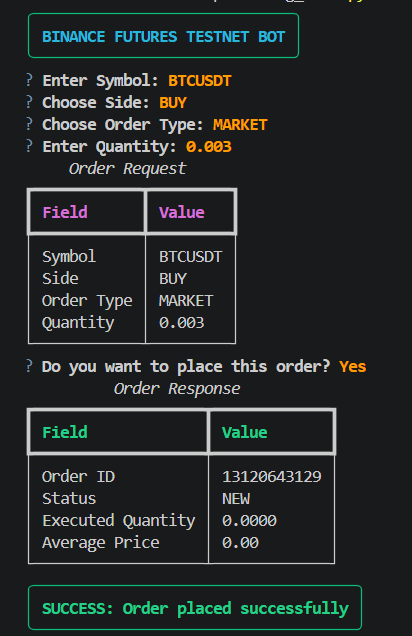
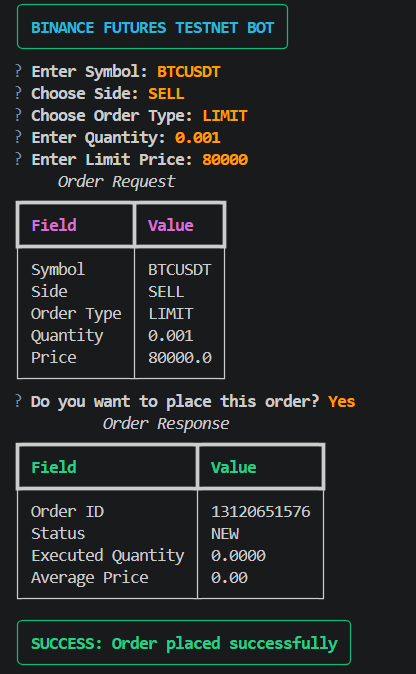

# Binance Futures Testnet Trading Bot

A simplified Python trading bot for Binance Futures Testnet (USDT-M) with interactive CLI support, order validation, structured logging, and clean modular architecture.

---

# Features

- Place MARKET orders
- Place LIMIT orders
- BUY and SELL support
- Binance Futures Testnet integration
- Interactive CLI using Questionary
- Rich terminal output formatting
- Validation and error handling
- API request/response logging
- Modular project structure

---

# Tech Stack

- Python 3.x
- python-binance
- Questionary
- Rich
- python-dotenv

---

# Setup

## Clone Repository

```bash
git clone https://github.com/rithikcr-mb/binance-futures-trading-bot.git
cd binance-futures-trading-bot
```

---

## Install Dependencies

```bash
pip install -r requirements.txt
```

---

## Configure Environment Variables

Create a `.env` file in the project root:

```env
BINANCE_API_KEY=your_api_key
BINANCE_API_SECRET=your_api_secret
```

You can generate testnet API credentials from Binance Futures Testnet.

---

# Usage

This project uses an interactive CLI-based workflow built with `questionary`.

Run the application:

```bash
python cli.py
```

You will be prompted interactively to enter:

- Trading symbol (e.g. BTCUSDT)
- Order side (BUY/SELL)
- Order type (MARKET/LIMIT)
- Quantity
- Price (required for LIMIT orders)

---

# Example Interactive Flow

```text
? Enter trading symbol: BTCUSDT
? Select side: BUY
? Select order type: MARKET
? Enter quantity: 0.001
```

After confirmation, the bot places the order on Binance Futures Testnet and displays:

- Order request summary
- API response details
- Success/failure status
- Logged output location

---

# Logging

All API requests, responses, and errors are logged to:

```text
trading_bot.log
```

---

# Project Structure

```text
trading_bot/
│
├── bot/
│   ├── __init__.py
│   ├── client.py
│   ├── orders.py
│   ├── validators.py
│   └── logging_config.py
│
├── screenshots/
│   ├── market_order.png
│   └── limit_order.png
│
├── cli.py
├── requirements.txt
├── .env.example
└── README.md
```

---

# Assumptions

- User already has a Binance Futures Testnet account
- API keys are valid
- Binance Futures Testnet services are operational

---

# Screenshots

## MARKET Order



## LIMIT Order



---

# Notes

- This application uses Binance Futures Testnet only
- API credentials should never be committed to GitHub
- This implementation uses an interactive terminal interface instead of argument-based CLI parsing (`argparse`/`Typer`)
